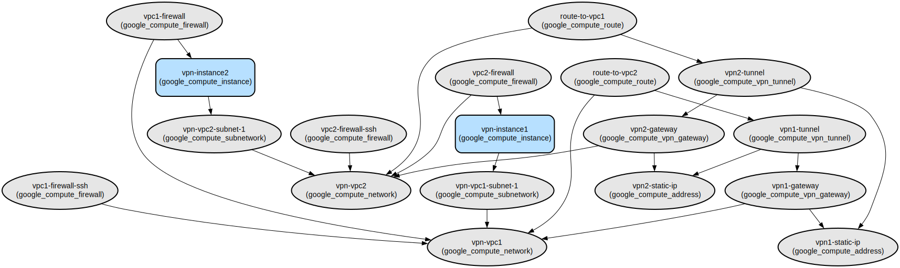

# GCP Multi-VPC VPN Connection Infrastructure as Code

This project provides a Terraform configuration for establishing a secure VPN connection between two Virtual Private Clouds (VPCs) in Google Cloud Platform. It automates the deployment of VPCs, compute instances, and VPN tunnels with proper networking and security configurations.

The infrastructure creates two separate VPCs in different regions (us-central1 and us-east1) with dedicated subnets, deploys Ubuntu instances running Nginx in each VPC, and establishes a secure VPN connection between them. The setup includes proper firewall rules to allow ICMP traffic between instances and SSH access for management purposes.

Key features include:
- Modular Terraform configuration for VPC, Compute, and VPN resources
- Automated VPN tunnel setup with IKEv2 authentication
- Regional VPC deployment with custom CIDR ranges
- Secure firewall rules for inter-VPC communication
- Nginx web server deployment on compute instances

## Repository Structure
```
terraform/
├── main.tf                 # Main configuration file defining VPC, instance, and VPN resources
├── provider.tf             # GCP provider configuration
├── variables.tf           # Global variable definitions
├── outputs.tf            # Output definitions
└── modules/              # Reusable Terraform modules
    ├── compute/         # Compute instance module for VM deployment
    ├── vpc/            # VPC module for network configuration
    └── vpn/           # VPN module for tunnel and gateway setup
```

## Usage Instructions
### Prerequisites
- Google Cloud Platform account with billing enabled
- Terraform v1.0.0 or later
- Google Cloud SDK
- Project Owner or Editor IAM role
- Enable required GCP APIs:
  - Compute Engine API
  - Cloud VPN API
  - Cloud Resource Manager API

### Installation

1. Install Terraform:
```bash
# MacOS
brew install terraform

# Linux
sudo apt-get update && sudo apt-get install terraform

# Windows
choco install terraform
```

2. Clone the repository and initialize Terraform:
```bash
git clone <repository-url>
cd terraform
terraform init
```

3. Configure GCP authentication:
```bash
gcloud auth application-default login
```

### Quick Start

1. Update the variables in `terraform.tfvars` or set environment variables:
```hcl
project_id = "your-project-id"
location = "us-central1"
ip_cidr_range1 = ["10.1.1.0/24", "10.1.2.0/24", "10.1.3.0/24"]
ip_cidr_range2 = ["10.2.1.0/24", "10.2.2.0/24", "10.2.3.0/24"]
```

2. Plan and apply the infrastructure:
```bash
terraform plan
terraform apply
```

### More Detailed Examples

Creating custom firewall rules:
```hcl
firewall_data = [
  {
    name = "custom-rule"
    source_ranges = ["192.168.1.0/24"]
    allow_list = [
      {
        protocol = "tcp"
        ports = ["80", "443"]
      }
    ]
  }
]
```

### Troubleshooting

Common Issues:
1. VPN Tunnel Not Establishing
   - Error: "Tunnel is down"
   - Check:
     ```bash
     gcloud compute vpn-tunnels describe vpn1-tunnel --region us-central1
     ```
   - Verify shared secret matches on both tunnels
   - Ensure firewall rules allow ESP, UDP 500, and UDP 4500

2. Instance Connectivity Issues
   - Error: "Connection timed out"
   - Enable debug logging:
     ```bash
     gcloud compute instances get-serial-port-output instance-name --zone us-central1-a
     ```
   - Verify route tables and firewall rules

## Data Flow
The infrastructure enables secure communication between two VPCs through VPN tunnels, allowing instances to communicate across regions.

```ascii
[VPC1 (us-central1)] <---> [VPN Tunnel] <---> [VPC2 (us-east1)]
     |                                              |
[Instance1]                                    [Instance2]
```

Component Interactions:
1. VPN gateways establish IPsec tunnels using IKEv2
2. Traffic between instances is routed through VPN tunnels
3. Firewall rules control ICMP and SSH access
4. Each VPC maintains its own subnet and route tables
5. Instances communicate using private IP addresses

## Infrastructure



### VPC Resources
- google_compute_network.vpc (x2)
  - Regional routing mode
  - Custom subnet creation
  - Firewall rules for ICMP and SSH

### Compute Resources
- google_compute_instance.instance (x2)
  - e2-micro machine type
  - Ubuntu 20.04 LTS
  - Nginx web server
  - No public IP addresses

### VPN Resources
- google_compute_vpn_tunnel (x2)
  - IKEv2 authentication
  - Static routing
  - Dedicated static IPs
- google_compute_forwarding_rule (x6)
  - ESP, UDP 500, and UDP 4500 protocols